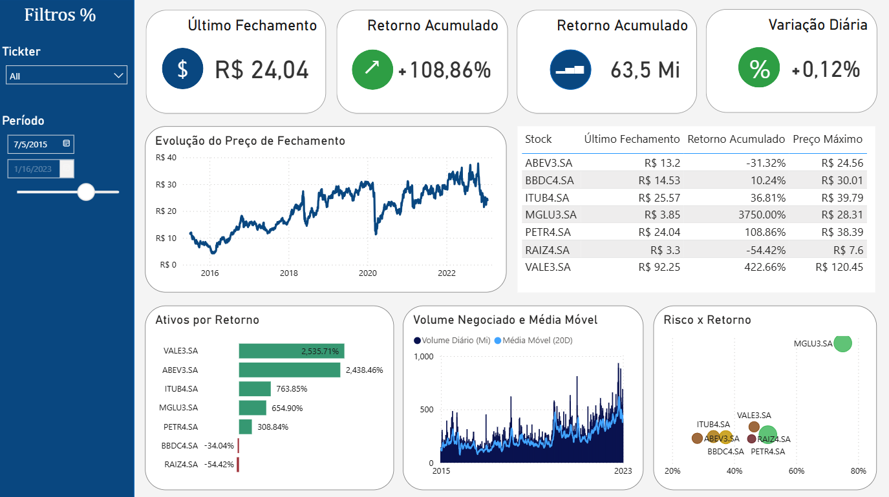

# Dashboard de Análise de Ações Brasileiras

Este projeto apresenta um dashboard desenvolvido em **Power BI** para análise de ações da Bolsa de Valores brasileira, utilizando dados históricos do dataset **Brazilian Stock Exchange Shares for Forecast**, disponível no Kaggle.

O objetivo do dashboard é facilitar a visualização do comportamento dos ativos ao longo do tempo, permitindo analisar preço de fechamento, retorno acumulado, volume negociado, variação diária, risco e desempenho comparativo entre diferentes ações.

---

## Dashboard

A imagem abaixo apresenta a visão geral do dashboard desenvolvido no Power BI.



---

## Sobre o Projeto

Este projeto foi criado com o objetivo de praticar análise de dados financeiros, modelagem no Power BI, criação de medidas DAX e construção de dashboards interativos.

A análise utiliza dados históricos de ações brasileiras e transforma essas informações em indicadores visuais que ajudam a entender o desempenho dos ativos no período analisado.

O dashboard permite observar tendências de preço, comparar o retorno entre ações, acompanhar o volume negociado e avaliar a relação entre risco e retorno.

---

## Fonte dos Dados

Os dados utilizados foram retirados do Kaggle:

**Brazilian Stock Exchange Shares for Forecast**

O dataset contém informações históricas de ações brasileiras, incluindo dados como:

- Data da negociação;
- Nome do ativo;
- Preço de abertura;
- Preço máximo;
- Preço mínimo;
- Preço de fechamento;
- Volume negociado;
- Fechamento anterior;
- Variação diária.

---

## Principais Indicadores

O dashboard apresenta quatro indicadores principais no topo da tela:

### Último Fechamento

Mostra o último preço de fechamento considerando o período selecionado.

No exemplo apresentado no dashboard, o valor exibido é:

**R$ 24,04**

Esse indicador ajuda a entender o preço mais recente do ativo ou do conjunto de ativos filtrados.

---

### Retorno Acumulado

Mostra a valorização ou desvalorização acumulada dentro do período analisado.

No exemplo apresentado no dashboard, o retorno acumulado é:

**+108,86%**

Esse número indica que, considerando o período selecionado, houve valorização acumulada positiva.

---

### Volume Negociado

Apresenta o volume total negociado dentro do período filtrado.

No exemplo apresentado no dashboard, o volume exibido é:

**63,5 Mi**

Esse indicador ajuda a entender a liquidez dos ativos analisados. Quanto maior o volume, maior tende a ser a movimentação do ativo no mercado.

---

### Variação Diária

Mostra a variação percentual mais recente do ativo ou do conjunto analisado.

No exemplo apresentado no dashboard, a variação diária é:

**+0,12%**

Esse indicador é útil para acompanhar o movimento mais recente do mercado dentro do período selecionado.

---

## Filtros Disponíveis

O dashboard possui filtros laterais que facilitam a análise dos dados.

### Filtro por Ticker

Permite selecionar um ativo específico ou visualizar todos os ativos ao mesmo tempo.

Exemplos de ativos presentes no dashboard:

- ABEV3.SA
- BBDC4.SA
- ITUB4.SA
- MGLU3.SA
- PETR4.SA
- RAIZ4.SA
- VALE3.SA

### Filtro por Período

Permite escolher o intervalo de datas analisado.

No exemplo exibido, o período vai de:

**05/07/2015 até 16/01/2023**

Esse filtro torna a análise mais flexível, permitindo avaliar o comportamento dos ativos em diferentes janelas de tempo.

---

## Visuais do Dashboard

### Evolução do Preço de Fechamento

Este gráfico de linha mostra a evolução histórica do preço de fechamento dos ativos ao longo do tempo.

Ele permite identificar:

- Tendências de alta;
- Tendências de queda;
- Períodos de maior volatilidade;
- Quedas bruscas;
- Recuperações após períodos negativos.

Um ponto interessante observado no gráfico é uma forte queda próxima ao ano de 2020, seguida por recuperação nos anos seguintes. Esse comportamento mostra um período de maior instabilidade no mercado.

---

### Resumo Financeiro por Ativo

A tabela ao lado do gráfico de evolução apresenta um resumo dos principais indicadores por ativo.

Ela contém informações como:

- Nome do ativo;
- Último fechamento;
- Retorno acumulado;
- Preço máximo.

Essa tabela facilita a comparação direta entre os ativos e ajuda a identificar rapidamente quais ações tiveram melhor desempenho no período.

Exemplo dos dados apresentados:

| Ativo | Último Fechamento | Retorno Acumulado | Preço Máximo |
|---|---:|---:|---:|
| ABEV3.SA | R$ 13,20 | -31,32% | R$ 24,56 |
| BBDC4.SA | R$ 14,53 | 10,24% | R$ 30,01 |
| ITUB4.SA | R$ 25,57 | 36,81% | R$ 39,79 |
| MGLU3.SA | R$ 3,85 | 3750,00% | R$ 28,31 |
| PETR4.SA | R$ 24,04 | 108,86% | R$ 38,39 |
| RAIZ4.SA | R$ 3,30 | -54,42% | R$ 7,60 |
| VALE3.SA | R$ 92,25 | 422,66% | R$ 120,45 |

---

### Ativos por Retorno

Este gráfico de barras mostra o retorno acumulado por ativo.

Ele permite identificar rapidamente quais ativos apresentaram melhor e pior desempenho no período analisado.

No dashboard, os destaques positivos são:

- VALE3.SA
- ABEV3.SA
- ITUB4.SA
- MGLU3.SA
- PETR4.SA

Já os ativos com desempenho negativo foram:

- BBDC4.SA
- RAIZ4.SA

Esse visual é importante porque resume o desempenho dos ativos de forma simples e comparativa.

---

### Volume Negociado e Média Móvel

Este gráfico apresenta o volume diário negociado junto com uma média móvel de 20 dias.

A média móvel ajuda a suavizar as oscilações diárias e facilita a identificação de tendências no volume de negociação.

Com esse visual, é possível observar:

- Períodos de aumento no volume;
- Picos de negociação;
- Crescimento ou queda no interesse pelos ativos;
- Momentos de maior movimentação no mercado.

No dashboard, é possível notar aumento do volume negociado nos anos mais recentes, indicando maior movimentação dos ativos analisados.

---

### Risco x Retorno

O gráfico de dispersão compara os ativos com base em duas dimensões:

- Retorno;
- Risco.

Esse tipo de visual é útil para entender quais ativos entregaram maior retorno em relação ao risco assumido.

No exemplo apresentado, o ativo **MGLU3.SA** aparece com retorno mais elevado, mas também com maior nível de risco. Já outros ativos ficam mais concentrados em regiões intermediárias, indicando menor oscilação em comparação.

Esse gráfico ajuda a responder perguntas como:

- Qual ativo teve maior retorno?
- Qual ativo apresentou maior risco?
- Quais ativos tiveram retorno interessante com risco menor?
- Quais ativos tiveram desempenho ruim mesmo assumindo risco?

---

## Insights Encontrados

### 1. MGLU3.SA apresentou alto retorno, mas também maior risco

O ativo **MGLU3.SA** se destaca no gráfico de risco x retorno, aparecendo como uma das ações com maior retorno acumulado no período, mas também com maior risco.

Isso indica que o ativo teve forte valorização em determinado momento, porém com alta volatilidade.

---

### 2. VALE3.SA teve desempenho relevante no período

A ação **VALE3.SA** aparece entre os melhores retornos acumulados e também possui um último fechamento elevado em comparação com os demais ativos.

Esse comportamento mostra que a ação teve uma valorização relevante ao longo do período analisado.

---

### 3. RAIZ4.SA apresentou desempenho negativo

O ativo **RAIZ4.SA** aparece com retorno acumulado negativo no período, indicando desvalorização em relação ao início da série analisada.

No gráfico de barras, ele aparece como um dos piores desempenhos.

---

### 4. O ano de 2020 teve forte impacto no preço dos ativos

No gráfico de evolução do preço de fechamento, é possível observar uma queda expressiva próxima ao ano de 2020.

Esse comportamento demonstra um momento de maior instabilidade no mercado, seguido por recuperação posterior.

---

### 5. O volume negociado aumentou nos anos mais recentes

O gráfico de volume negociado mostra maior intensidade de negociação nos anos mais recentes da base.

Esse aumento pode indicar maior liquidez, maior interesse do mercado ou maior movimentação dos ativos analisados.

---

### 6. Maior retorno também pode significar maior risco

O gráfico de risco x retorno mostra que alguns ativos com maior retorno também apresentam maior risco.

Isso reforça a importância de analisar retorno e volatilidade em conjunto, e não apenas olhar para a valorização acumulada.

---

## Medidas Criadas no Power BI

Durante o desenvolvimento do dashboard, foram criadas medidas em DAX para calcular indicadores importantes, como:

- Último fechamento;
- Retorno acumulado;
- Variação diária;
- Volume total;
- Volume médio;
- Preço máximo;
- Preço mínimo;
- Volatilidade;
- Risco x retorno.

Essas medidas permitiram transformar os dados brutos em indicadores analíticos mais úteis para interpretação dos resultados.

---

## Ferramentas Utilizadas

- Power BI
- Power Query
- DAX
- Kaggle
- Excel/CSV

---

## Estrutura do Projeto

A estrutura sugerida para o repositório é:

```text
dashboard-acoes-brasileiras/
│
├── README.md
├── dashboard.pbix
└── img/
    └── dash1.png
